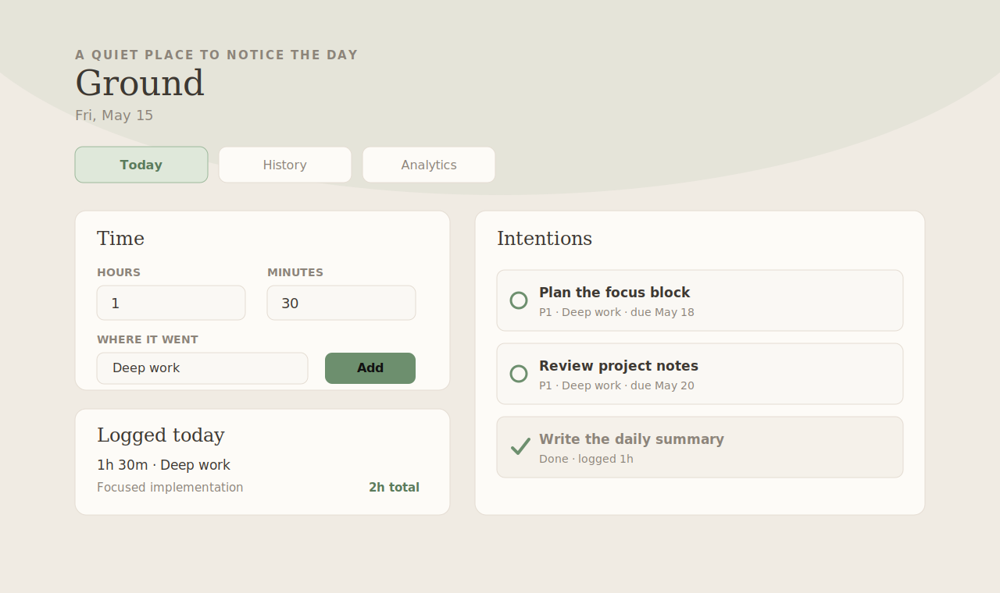

# Ground

Ground is a small personal time and intentions tracker. It is not trying to be
the universal productivity app. It is a piece of boutique software: a tool shaped
around one person's working rhythm, built quickly enough that personal fit can
matter more than market size.

I built it after my manager suggested that I write down where my time was going.
That turned into a simple daily surface for logging time, carrying intentions
across days, and noticing patterns without turning the day into project
management ceremony.

The live app is private by design. This repository is public so the code,
deployment shape, and product thinking can be inspected.



## Features

- Daily time logging by category, duration, note, and timestamp.
- Today, tomorrow, and future intention buckets.
- Carryover flow for unfinished tasks from yesterday.
- Task priority, deadline, completion, reordering, duplication, and quick time
  logging from a task.
- History and lightweight analytics over recent time logs and intentions.
- Filesystem JSON persistence for a small single-user deployment.
- Basic Auth and Railway volume support for a private live deployment.

## Architecture

Ground is intentionally boring:

- Flask serves the API and static frontend.
- Vanilla HTML/CSS/JS keeps the client easy to inspect and modify.
- JSON files store daily entries and todos under `DATA_DIR`.
- Gunicorn runs the app in production.
- Railway provides hosting and a persistent volume.

This is enough for a personal tool. If the app grows into a multi-user product,
the persistence layer should move to SQLite or Postgres.

## Local Setup

```bash
python3 -m venv .venv
source .venv/bin/activate
pip install -r requirements.txt
python app.py
```

Open http://127.0.0.1:8765.

By default, local data is written to `./data`. To try the sample data:

```bash
DATA_DIR=./data.example APP_ENV=development python app.py
```

## Configuration

| Variable | Default | Notes |
| --- | --- | --- |
| `APP_ENV` | unset | Use `development` locally or `production` on Railway. |
| `APP_TIMEZONE` | `Asia/Kolkata` | Controls day boundaries and logged timestamps. |
| `DATA_DIR` | `./data` | Directory for `todos.json` and daily `YYYY-MM-DD.json` files. |
| `APP_USERNAME` | unset | Required in production for Basic Auth. |
| `APP_PASSWORD` | unset | Required in production for Basic Auth. |
| `PORT` | `8765` | Used by local `python app.py`; Railway provides this automatically. |

When `APP_ENV=production`, requests are protected with HTTP Basic Auth. In local
development, auth is bypassed if `APP_ENV=development` or both auth variables
are absent.

## Railway Deployment

The recommended deployment is Railway with a private URL and HTTP Basic Auth.

1. Create a Railway project from this GitHub repo.
2. Set the start command from the included `Procfile`.
3. Add a persistent volume mounted at `/app/data`.
4. Set these Railway variables:

```text
APP_ENV=production
APP_TIMEZONE=Asia/Kolkata
DATA_DIR=/app/data
APP_USERNAME=<your username>
APP_PASSWORD=<a long random password>
```

Railway will provide `PORT`. The app includes `X-Robots-Tag: noindex, nofollow`
and `/robots.txt` to discourage indexing, but auth is still required because the
URL is public.

Do not publish your live Railway URL unless you intentionally want people to find
the login prompt. This repo is the public artifact; the running app can stay
private.

## Data and Backups

Real data files under `data/*.json` are intentionally ignored by git. For a
personal deployment, JSON-on-filesystem persistence is fine as long as the app
runs as a single instance and the Railway volume is backed up.

Before making this repo public:

- confirm no real `data/*.json` files are tracked;
- confirm `.env` and deployment secrets are not tracked;
- review commit history for accidental personal data;
- keep `data.example/` as the public sample dataset.

To back up a Railway volume, download or copy the files under `/app/data`.

## Why This Exists

Most todo apps ask you to adapt to their model. Ground goes the other way. The
sections, ordering, categories, and tiny interactions are allowed to be personal
because the intended audience is one person.

That is the interesting part to me: cloud hosting made small apps easy to run,
and AI-assisted development makes small apps easier to justify. We do not need
every useful piece of software to become a startup, a SaaS plan, or a generic
tool for everyone. Some software can simply fit the person using it.

## License

MIT
